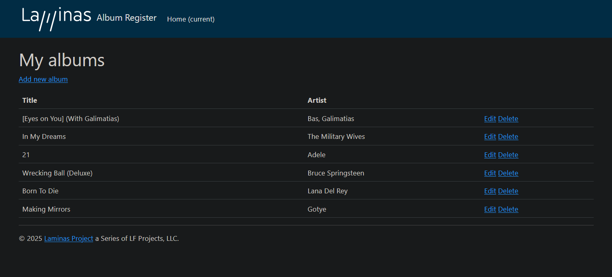

# Laminas MVC Skeleton + Docker + MySQL

Este projeto é uma aplicação básica de listagem (CRUD) de albuns usando o **Laminas MVC**, rodando em **Docker**, com suporte a:



- Banco de dados MySQL
- Formulários (`laminas-form`)
- Validação e filtros (`laminas-inputfilter`, `laminas-filter`)
- Internacionalização (`laminas-i18n`)

---

## 🚀 Tecnologias

- PHP 7.3 (Apache)
- Laminas MVC
- MySQL 8
- Docker / Docker Compose

---
 
## ⚙️ Como rodar o projeto

### 1. Clone o repositório

```bash
git clone https://github.com/seu-usuario/seu-projeto.git
cd seu-projeto
```

### 2. Suba os containers com Docker

```bash
docker-compose up -d --build
```

Isso irá subir:
- laminas (PHP + Apache)
- db (MySQL)

### 3. Instale as dependências PHP (dentro do container)
```bash
docker exec -it laminas bash
composer install
```

### 4. Acesse no navegador
Abra no navegador: http://localhost:8080

--- 
## 🗃️ Banco de Dados
### Configuração

    Host: db
    Usuário: root
    Senha: root
    Database: AlbumDb

### Criar a base de dados:
Acesse o container do banco e crie o schema localizado em:
`data/schema.sql`

## 📦 Pacotes usados

```bash
composer require laminas/laminas-form laminas/laminas-inputfilter laminas/laminas-filter laminas/laminas-i18n
```

## 🐳 Estrutura Docker
### Dockerfile

- PHP 7.3 + Apache
- Extensões instaladas:
    - pdo
    - pdo_mysql
    - intl
    - zip

## ✅ Checklist do Projeto

- Laminas MVC Skeleton
- Banco MySQL com Docker
- Conexão via laminas-db
- Módulo Album com CRUD
- Suporte a formulários
- Validação e filtros

## 🧠 Dicas

#### 1. Sempre execute os comandos composer dentro do container PHP.
#### 2. Se mudar o Dockerfile, sempre rode: 
    docker-compose build --no-cache.